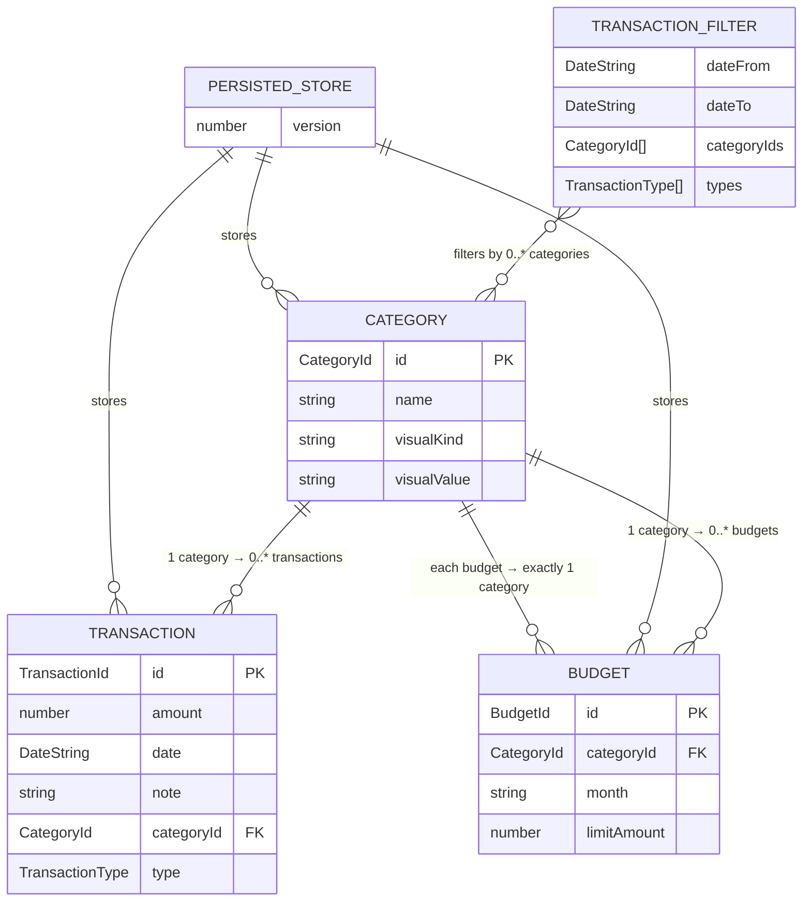
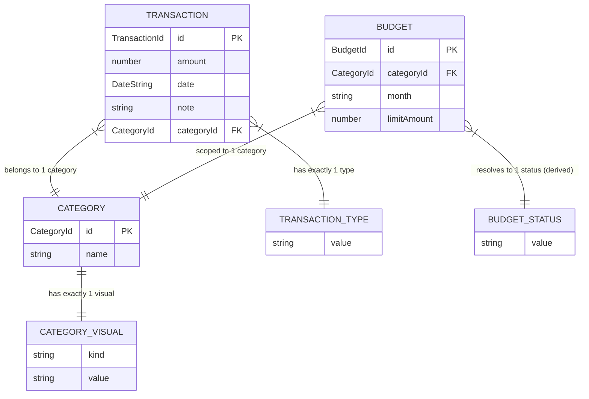
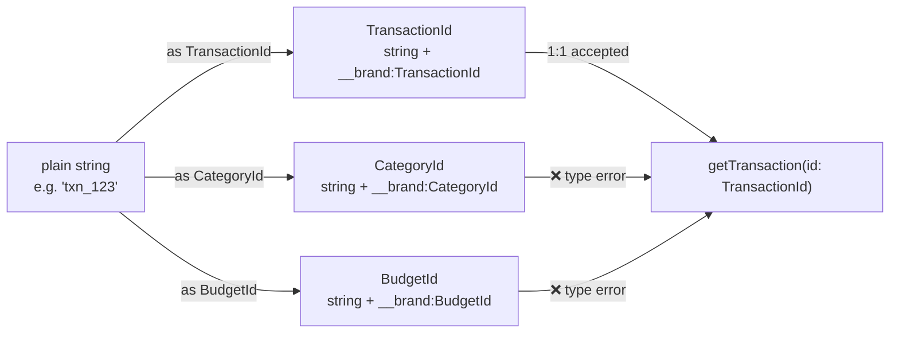

# Types Diagram

To render as an image, paste any diagram block below into [mermaid.live](https://mermaid.live/), or open this file in VS Code with the [Markdown Preview Mermaid Support](https://marketplace.visualstudio.com/items?itemName=bierner.markdown-mermaid) extension.

---

## 1 — Entity Relationships with Cardinality

---

## 2 — Type Composition (full model)

---

## 3 — Branded ID Safety (compile-time only)

